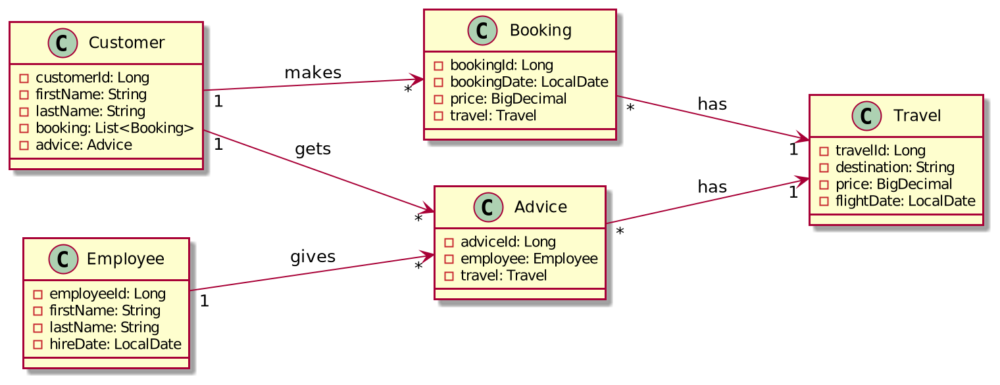

# Microproject - Travel Agency
A travel agency has employees and sells travel bookings. An employee makes an offer to a customer,
which then either chooses to make their own booking or takes the advice. Each Booking has a travel.
An advice is basically a booking  offered by an employee.

 

The job of an employee is to advise a customer with a booking offer. That booking offer is based on certain
criteria(destination) that the customer gives. Since an employee tries to sell bookings
they will have a statistic of how much much money they made for the travel agency.

A customer can make and can cancel a booking.

## [Swagger-Page](http://localhost:8080/swagger-ui)
